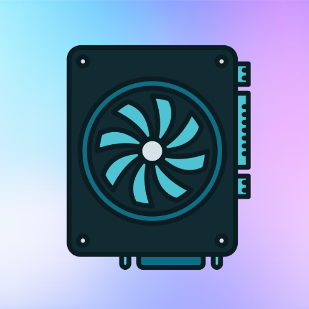
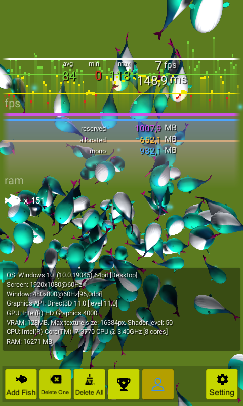

# GPU-Graphics-Performance
The application tests the graphics performance of your device

**GPU Master Monitor: Your Ultimate Graphics Performance Testing Tool**  

Are you curious about how powerful your device’s graphics really are? Introducing **GPU Master Monitor**, the cutting-edge app designed to showcase and test your device’s graphics capabilities like never before! 

🎮 **Test Your Graphics with Fun and Precision**  
Experience the thrill of pushing your device to its limits by dropping vibrant 3D fish into a stunning virtual aquarium. The more fish you add, the greater the load on your GPU. Watch as your device’s FPS (frames per second) and performance indicators are measured in real-time, giving you a clear picture of your graphics power. How many fish can your device handle? Challenge it to find out!

📊 **Real-Time Performance Charts**  
Take a deep dive into your system’s performance with beautifully crafted, real-time graphical charts. Monitor your GPU’s efficiency over time, track frame rates, and identify performance bottlenecks with ease.  

🎵 **Integrated Music for an Enjoyable Experience**  
Turn testing into entertainment with a variety of built-in songs that keep you immersed in the experience. GPU Master Monitor isn’t just a tool—it’s an interactive, enjoyable performance showcase.  

💻 **Detailed Device Insights**  
Beyond graphics, GPU Master Monitor provides in-depth information about your device’s hardware, operating system, and audio settings. Explore everything your device has to offer with one simple app!  

🎨 **Sleek and Intuitive Design**  
Enjoy a visually stunning and user-friendly interface designed to make monitoring a breeze. From sleek menus to colorful 3D visuals, everything about GPU Master Monitor is optimized for both functionality and aesthetics.  

✨ **Why Wait? Test Your GPU Like a Pro!**  
Whether you're a gamer, a developer, or just a tech enthusiast, GPU Master Monitor is the perfect app to evaluate your device’s graphics capabilities and system performance. Download now to unleash the full potential of your hardware and take control of your device’s performance!  

**📥 Get GPU Master Monitor Today and Let the Challenge Begin!**  